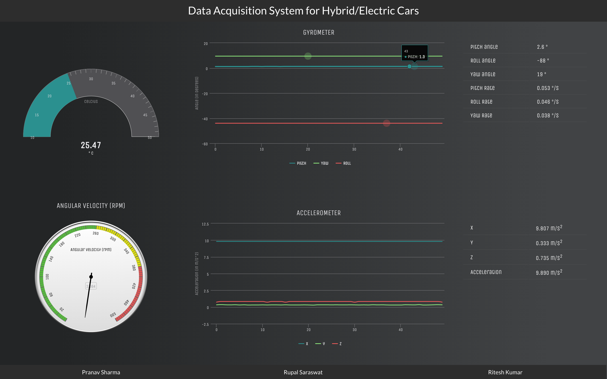
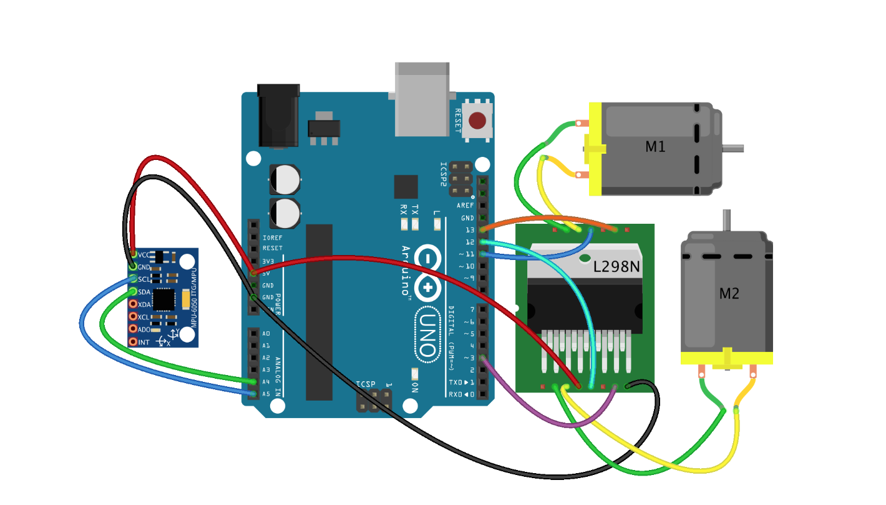

Arduinode
---------

Data Acquisition System for a Hybrid/Electric Car.



Technologies Used
-----------------
* AngularJS
* NodeJS
* Johnny-five

Hardwares used
--------------
* Arduino UNO R3
* MPU 6050
* Sparkfun motor control shield

Features
--------

* Data shown on graphs read by MPU 6050
* 3d gyro visualisation on screen using three.js
* Motor controlling by keystrokes

Setup the app and arduino
-------------------------
* Download [Arduino IDE](http://www.arduino.cc/en/main/software)
* Plug in your Arduino or Arduino compatible microcontroller via USB
* Open the Arduino IDE, select: File > Examples > Firmata > StandardFirmata
* Click the "Upload" button.
* Do the MPU-6050 sensor connections with the arduino uno r3 as shown in the diagram below
  
* Connect the arduino to the laptop.
* Run ```npm install && bower install``` the first time you run the app.
* Run ```node server.js```
* open the url ```http://127.0.0.1:8081``` on the browser.


